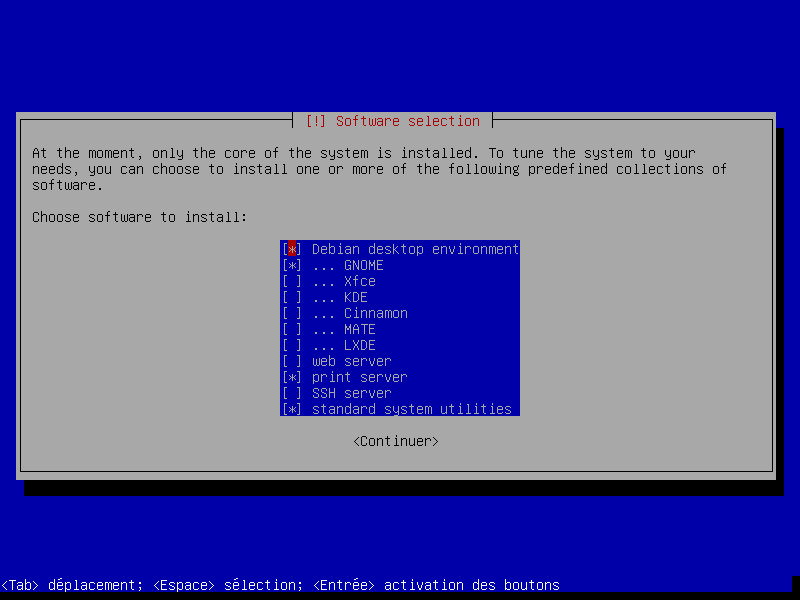

# proinfo-debian-config
Coleção de arquivos de configuração dos multiterminais para Debian GNU/Linux em computadores do ProInfo

# Introdução

Com o lançamento da versão 8 - codinome [Jessie](https://www.debian.org/News/2015/20150426) - em 25 de abril de 2015, o sistema operacional [Debian GNU/Linux](http://www.debian.org) junta-se a um time de distribuições Linux (que inclui [Fedora](https://getfedora.org), [openSUSE](https://www.opensuse.org), [Arch Linux](https://www.archlinux.org) e [Ubuntu](http://www.ubuntu.com), entre outros) que passaram a adotar por padrão o [systemd](http://www.freedesktop.org/wiki/Software/systemd/) e seu conjunto de ferramentas para inicialização e gerenciamento de sistema. Não obstante todas as polêmicas que envolvem o systemd e a comunidade Unix, a adoção desta ferramenta torna possível a correta configuração do multiterminal nos computadores do ProInfo sem a necessidade de recorrer a soluções comerciais, como o [Userful Multiseat](http://www.userful.com).

Desde que as primeiras distribuições Linux com o systemd incluído começaram a ser lançadas, temos estudado a melhor forma de utilizá-las com os computadores multiterminais do ProInfo. Os primeiros frutos deste estudo foram os tutoriais de configuração do multiterminal para [Ubuntu 14.04 LTS](https://www.overleaf.com/read/btwzqzgxcgsh) e [openSUSE 13.2](https://www.overleaf.com/read/nrytsgpnzwcj). A partir da experiência adquirida com a elaboração destes tutoriais, trazemos agora uma nova abordagem para o Debian 8 "Jessie": um conjunto de scripts e arquivos de configuração genéricos que permitem uma pré-configuração automática do multiterminal.

# A quais pregões do ProInfo este material se aplica?

O procedimento aqui descrito foi testado em computadores dos pregões FNDE **83/2008** e **71/2010**, que possuem 2 ou 3 terminais e utilizam uma placa de vídeo [ThinNetworks TN-502 Dual](http://www.thinnetworks.com.br/wp-content/files_mf/1330608460DatasheetTN502DualQuadEight.pdf), baseada no chip [Silicon Motion SM501](http://d1.amobbs.com/bbs_upload782111/files_27/ourdev_538633.pdf). Essa placa utiliza o driver de vídeo [xf86-video-siliconmotion](http://cgit.freedesktop.org/xorg/driver/xf86-video-siliconmotion/), que, apesar de antigo, ainda funciona em distribuições Linux modernas, com algumas ressalvas (bug da tela listrada, ver mais abaixo).

Os computadores dos pregões FNDE **69/2008** e **68/2009 (1º lote)**, que possuem uma placa de vídeo [ThinNetworks ATI Rage XL Quad](http://wiki.thinnetworks.com.br/Especifica%C3%A7%C3%B5es-ATI-Rage-XL-Editando.html), utilizariam o driver de vídeo [xf86-video-mach64](http://cgit.freedesktop.org/xorg/driver/xf86-video-mach64/). Infelizmente, porém, esse driver não é mais mantido pela comunidade e deixou de funcionar corretamente nessa placa em distribuições Linux lançadas nos últimos 5 anos. Portanto, os computadores destes pregões **não** são elegíveis à utilização do multiterminal no Debian 8, a menos que seja feita a substituição da placa de vídeo por outra compatível.

Os computadores do pregão FNDE **68/2009 (2º lote)**, que possuem um par de placas TN-502 Dual, são elegíveis à utilização do multiterminal no Debian 8. No entanto, algumas adaptações se fazem necessárias nos scripts e arquivos de configuração, o que ainda não fizemos por não dispormos de equipamentos deste pregão para realizar os testes.

Não sabemos se este procedimento se aplica aos computadores do pregão FNDE **23/2012**, pois não temos informações sobre as suas especificações de *hardware* e não dispomos de equipamentos deste pregão para testes.

# Perfis de configuração do multiterminal

Os scripts de auto-configuração do multiterminal estão organizados em 4 perfis de configuração possíveis, a saber:

* **2 terminais, 1 hub:** o teclado e mouse do terminal primário são ligados diretamente ao computador, enquanto um hub USB é utilizado com o terminal secundário.
* **3 terminais, 2 hubs:** o teclado e mouse do terminal primário são ligados diretamente ao computador, enquanto hubs USB são utilizados com os terminais secundários.
* **2 terminais, 2 hubs:** ambos os terminais primário e secundário usam hubs USB para conectar teclado e mouse.
* **3 terminais, 3 hubs:** todos os 3 terminais usam hubs USB para conectar teclado e mouse.

A menos que o administrador deseje continuar utilizando o Linux Educacional lado a lado com o Debian 8, ou simplesmente não possa conectar o teclado e mouse do terminal primário diretamente ao computador (terminais muito afastados do computador, portas USB ocupadas com outros periféricos, etc.), é altamente recomendável que se retire o hub USB do terminal primário, conectando teclado e mouse diretamente ao computador (perfis "2 terminais, 1 hub" ou "3 terminais, 2 hubs").

## Disposição das portas USB e saídas de vídeo no computador

Todos os perfis de configuração do multiterminal, exceto o "2 terminais, 1 hub", assumem uma escolha prévia da porta USB e/ou da saída de vídeo à qual estarão associados os terminais secundários. No computador do pregão 71/2010 no qual os arquivos deste repositório foram preparados, a disposição das portas USB no painel traseiro do computador é a seguinte:

  Porta USB 3   |   Porta USB 1
----------------|----------------
**Porta USB 4** | **Porta USB 2**

Da mesma forma, as saídas de vídeo da placa TN-502 estão dispostas na seguinte ordem:

Saída de vídeo VGA | Saída de vídeo LVDS
-------------------|--------------------

## Perfil "2 terminais, 1 hub"

Este é o perfil mais simples de todos. Como há um único hub USB em operação, é fácil para o sistema identificá-lo. Neste caso, os arquivos de pré-configuração do multiterminal funcionam corretamente, seja qual for a porta USB na qual o hub esteja conectado. Pode-se ligar o monitor secundário a qualquer uma das saídas de vídeo da placa TN-502.

## Perfil "2 terminais, 2 hubs"

Neste caso, como temos 2 hubs USB idênticos em operação, o sistema somente consegue distingui-los pelo endereço da porta USB na qual estão conectados (o mesmo acontece nos demais perfis abaixo). Os arquivos de pré-configuração aqui disponíveis reservam a **porta USB 4** para que se conecte o hub USB associado ao terminal secundário. Pode-se ligar o monitor secundário a qualquer uma das saídas de vídeo da placa TN-502.

## Perfis "3 terminais, 2 hubs" e "3 terminais, 3 hubs"

Nestes casos, os arquivos de pré-configuração do multiterminal estão preparados de tal forma que um terminal secundário utilize a **porta USB 2** em conjunto com a **saída de vídeo VGA**, enquanto outro utilize a **porta USB 4** em conjunto com a **saída de vídeo LVDS**. As portas USB 1 e 3 ficam disponíveis para o terminal primário, que pode utilizar, ou não, um hub USB para conectar teclado e mouse.

Estes perfis exigem a instalação de uma versão modificada do pacote *xserver-xephyr* ([64 bits](http://download.opensuse.org/repositories/home:/lbssousa:/multiseat:/debian/Debian_8.0/amd64/xserver-xephyr_1.16.4-1+deb8u1~multiseat1_amd64.deb), [32 bits](http://download.opensuse.org/repositories/home:/lbssousa:/multiseat:/debian/Debian_8.0/amd64/xserver-xephyr_1.16.4-1+deb8u1~multiseat1_i386.deb)), bem como sua dependência *xserver-common*  ([64 bits](http://download.opensuse.org/repositories/home:/lbssousa:/multiseat:/debian/Debian_8.0/amd64/xserver-common_1.16.4-1+deb8u1~multiseat1_amd64.deb), [32  bits](http://download.opensuse.org/repositories/home:/lbssousa:/multiseat:/debian/Debian_8.0/amd64/xserver-common_1.16.4-1+deb8u1~multiseat1_i386.deb)), mas os scripts de auto-configuração do multiterminal se encarregam de instalar esses pacotes, o que não deve trazer grandes dificuldades para o administrador. Tais modificações já foram [submetidas para revisão](http://lists.x.org/archives/xorg-devel/2015-June/046697.html) aos desenvolvedores do projeto X.Org.

# Instalação do Debian 8

A instalação do Debian em si não deve trazer grandes desafios para o administrador, então não vamos entrar em detalhes aqui. No entanto, vale a pena fazer algumas observações:

## Senha de root

Diferentemente do instalador do Ubuntu, por exemplo, o instalador do Debian permite configurar explicitamente a senha de *root*. Caso o administrador não deseje criá-la, basta deixar o campo da senha em branco (neste caso, o usuário comum que será criado em seguida será o administrador do sistema, com pregorrativa de uso do comando *sudo* para executar comandos como *root*, assim como no Ubuntu).

## Particionamento do disco rígido

É possível que o administrador não se sinta muito confortável com o particionador de disco do Debian. Neste caso, sugerimos fazer o particionamento prévio do disco utilizando um LiveCD de outro sistema (Ubuntu, por exemplo) que ofereça a ferramenta gráfica de particionamento **GParted**, antes de executar o instalador do Debian.

**Não exclua nem formate sua partição do Linux Educacional (sda1)!** Ela pode ser importante para contornar um eventual "bug da tela listrada" (ver abaixo). Em vez disso, reduza o seu tamanho e instale o Debian lado a lado no espaço restante.

No momento, sugerimos a seguinte tabela de partições para o disco rígido:

* **sda1**
  * Reduzir o tamanho para um valor apropriado (entre 6 e 10GB, dependendo da intenção de continuar usando o Linux Educacional)
  * Usar com o sistema de arquivos **ext4**
  * Não formatar
  * Montar em `/mnt/le` **[opcional]**
* **sda2**
  * Tamanho: 500MB
  * Usar com o sistema de arquivos **ext2**
  * Formatar
  * Montar em `/boot`
* **sda3**
  * Usar todo o espaço restante do disco
  * Usar com o sistema de arquivos **btrfs** ou **ext4**
  * Formatar
  * Montar em `/`

Ao finalizar a configuração da tabela de partições segundo o modelo acima, o instalador do Debian deve alertar o administrador sobre a falta de uma **partição de troca (swap)**. O administrador deve ler o alerta com atenção e confirmar que deseja prosseguir com a instalação, mesmo sem uma partição de troca (a falta dela será compensada pelo uso da tecnologia *ZRam*, que será ativado pelos scripts de auto-configuração do multiterminal).

## Instalação normal X Instalação mínima

Os scripts de auto-configuração do multiterminal disponíveis neste repositório variam de acordo com o tipo de instalação escolhida para o Debian. Para entender a diferença, observe a figura abaixo:
]

### Instalação normal

Na tela acima do instalador do Debian, marque apenas as opções **Ambiente de trabalho Debian**, o ambiente de trabalho desejado (para os computadores multiterminais, recomendamos o LXDE, o XFCE ou o MATE), **Servidor de impressão** e **Servidor SSH**. Ao final da instalação, você terá um ambiente de trabalho já pronto para uso, bastando executar posteriormente um dos scripts `setup-2seats-1hub.sh`, `setup-2seats-2hubs.sh`, `setup-3seats-2hubs.sh` ou `setup-3seats-3hubs.sh` para finalizar a configuração do multiterminal.

### Instalação mínima

Na tela acima do instalador do Debian, marque apenas as opções **Servidor de impressão** e **Servidor SSH**, ou seja, não marque a opção **Ambiente de trabalho Debian**. Ao final da instalação, você terá apenas uma interface de linha de comando (console), mas poderá instalar facilmente o ambiente de trabalho desejado já com o multiterminal pré-configurado executando um dos scripts disponíveis. As famílias de scripts `setup-*-lxde-minimal.sh`, `setup-*-xfce-minimal.sh` e `setup-*-mate-minimal.sh` instalam os ambientes de trabalho LXDE, XFCE e MATE, respectivamente. Escolha o script de acordo com o perfil de multiterminal desejado (exemplo: o script `setup-3seats-2hubs-mate-minimal.sh` instala o ambiente de trabalho MATE e configura o sistema para 3 terminais usando 2 hubs).

Vale ressaltar que os scripts em questão realizam apenas a instalação mínima necessária para rodar o ambiente de trabalho com o multiterminal. Outros aplicativos (navegador web, reprodutor multimídia, plugins e applets adicionais do ambiente de trabalho, etc.) poderão ser instalados em um segundo momento, a critério do administrador. Com essa iniciativa, é possível reduzir consideravelmente o consumo de memória RAM (ver tabelas abaixo), dependendo do ambiente de trabalho escolhido, pois deixamos de instalar certos serviços desnecessários para os computadores do ProInfo, mas que são instalados por padrão em uma instalação normal do Debian.

# Números obtidos com o Debian 8 configurado para 3 terminais

* Testes realizados em um computador do pregão 71/2010 no dia 03/07/2015. Os resultados podem variar de um computador para outro.
* Tempo médio de boot (da tela do GRUB à tela de login): **18 segundos**
* Para as tabelas abaixo, a margem de erro foi estimada em ±5MB.

|Consumo de memória RAM em uma instalação normal para 3 terminais | LXDE  | XFCE  | MATE  |
|-----------------------------------------------------------------|-------|-------|-------|
| Antes do login                                                  | 218MB | 223MB | 205MB |
| Imediatamente após o login nos 3 terminais                      | 431MB | 403MB | 385MB |
| Acréscimo médio por login                                       |  71MB |  60MB |  60MB |

|Consumo de memória RAM em uma instalação mínima para 3 terminais | LXDE  | XFCE  | MATE  |
|-----------------------------------------------------------------|-------|-------|-------|
| Antes do login                                                  | 172MB | 172MB | 171MB |
| Imediatamente após o login nos 3 terminais                      | 293MB | 286MB | 303MB |
| Acréscimo médio por login                                       |  40MB |  38MB |  44MB |
